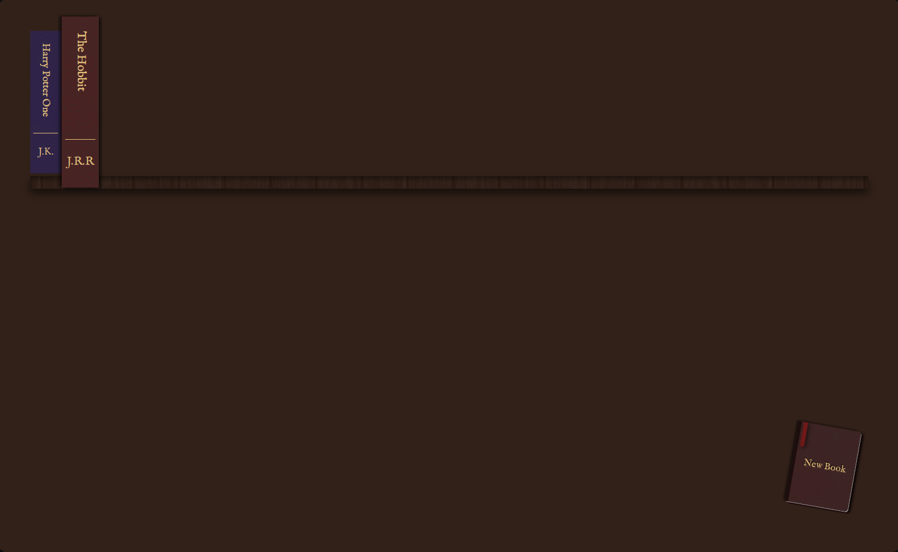
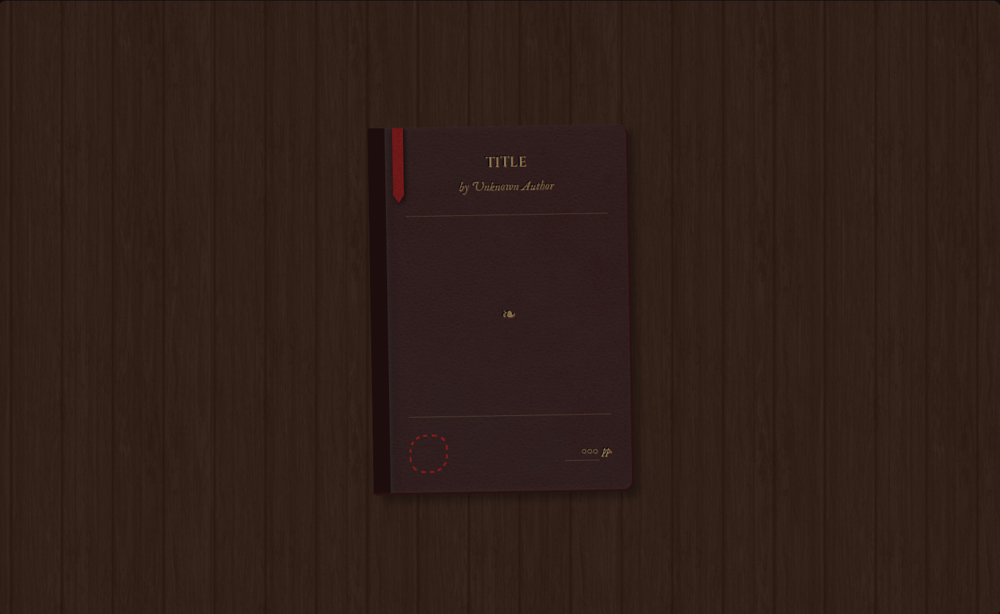

# Infinity Library

A virtual library application where users can curate their book
collection, featuring a medievalesque aesthetic with leathered books,
embedded with gold typography.





<!-- TOC -->

## Table of Contents

- [Features](#features)
- [Installation](#installation)
- [Usage](#usage)
- [To-Do](#todo)
- [Preview](#preview)
- [Acknowledgments](#acknowledgments)
- [Credits](#credits)
- [License](#license)

<!-- /TOC -->

## Features

- **Realistic Book Dialog**: Dialog form is styled like an actual book with
  title, author, pages, and read status.
- **Wax Seal**: Marking a book as read will stamp the book with a realistic
  wax seal.
- **Dynamic shelves**: Depending on how many books there are, shelves are
  auto generated so your books will always have something to sit on.
- **Color variety**: All books displayed on the shelves come with distinct
  colors for visual variety.
- **Editing**: Clicking on your created books allow you to edit them.
- **Responsive Animations**: When opening dialog, book slides into view
  like you are putting down a book on a table; and on shelves, they mimic
  pulling out the books.
- **Responsive Bookshelf**: When resizing your browser window, your
  collection of books will adjust to new rows automatically, with a shelf
  below them too of course.

## Installation

1. Clone the repository: 
  ```bash 
  git clone https://github.com/Calsjunior/infinity-library.git
  ```
2. Open `index.html` in any modern web browser.

## Usage

Clicking on the miniature book on the bottom right will allow you to fill
up a form for your book. After you're satisfied, tugging (clicking) the
ribbon on the top left will submit the form, and your book will be
displayed on the shelf.

## To-Do

- Add color variety to dialog book
- Add a way to remove books that also looks pleasing
- Add dynamic heights and widths to books for more variety

## Preview

[Infinity Library](https://calsjunior.github.io/infinity-library/)

## Acknowledgments

- This project was completed as a part of [The Odin Project's](https://www.theodinproject.com/) JavaScript curriculum.

## Credits

- **Wax Seal Design**: https://codepen.io/drewstaylor/pen/oNXjmgb
- **Bookshelf Idea**: https://github.com/petargyurov/virtual-bookshelf

## License

[MIT (c) Calsjunior](LICENSE)
